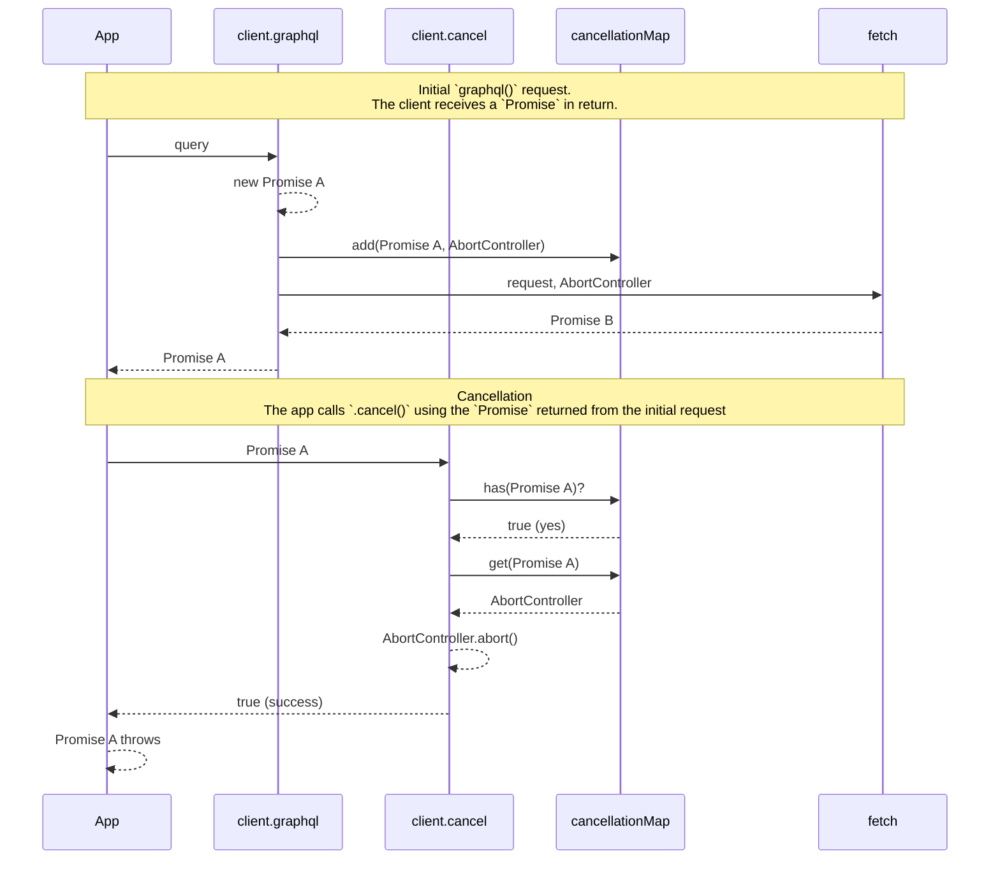

# Cancellation

The Amplify library generally supports canceling service requests after they've been issued, but prior to their completion. This is done on a best-effort basis using the [`AbortController`](https://developer.mozilla.org/en-US/docs/Web/API/AbortController) mechanism. For modeled operations (operations that are generated attached to the client based on the customer schema), there is some added complexity.

This document provides an *overview* of how the core cancellation works and how it has been extended to modeled operations.

### Basic `graphql()` Cancellation Support

High level overview of how "core" cancellation works. Strictly speaking, there's an additional layer of mapping between GraphQL category and REST category. But, for the sake of simplicity, we can think of it like this:



### Default (Broken) State for Modeled 

Without some additional mapping, modeled operations are not cancelable as desired. Again, simplifying the REST layer out of our conceptual model, here's the flow: 

```mermaid
sequenceDiagram
    participant App
    participant client.model.get()
    participant client.graphql
    participant client.cancel
    participant cancellationMap
    participant fetch
    
    note over App, fetch: Initial `graphql()` request.<br />The client receives a `Promise` in return.
    
    App ->> client.model.get() : id
    client.model.get() ->> client.graphql : query
    client.graphql -->> client.graphql : new Promise A
    client.graphql ->> cancellationMap : add(Promise A, AbortController)
    client.graphql ->> fetch : request, AbortController
    fetch -->> client.graphql : Promise B
    client.graphql -->> client.model.get() : Promise A
    client.model.get() -->> App : Promise C
    
    note over App, fetch: Cancellation<br />The app calls `.cancel()` using the `Promise` returned from the initial request.
    
    App ->> client.cancel : Promise C
    client.cancel ->> cancellationMap : has(Promise C)?
    cancellationMap -->> client.cancel : false (no)
    client.cancel -->> App : false (failure)
```

TLDR; the `cancel()` operation recognizes the `Promise` from `.graphql()`, but the `Promise` that modeled operations hand back to customer code is *not* that same `Promise`!

### The Solution

We will "register" the newly created `Promise` from modeled operations (`Promise C`) and "monkey patch" `client.cancel()` so that it can find the original `AbortController`. And, we will add further testing to ensure that cancellation of core `graphql()` operations are not negatively impacted.

Things we considered:

1. **The mapping from `Promise` to `AbortController` is *well-encapsulated* in the API REST category.** There is no existing way to add promises to the map. Exposing the map or controls to add to the map would increase the public surface area of the GraphQL and REST categories.
2. **Mapping *additional* `Promise`-es to the original `AbortController` would make cleanup more complex.** When the "base Promise" is created, it registers a cleanup callback that looks for itself and removes itself from the `cancellationMap`. If we add more promises to this map, the cleanup gets more complicated.
3. **`api-graphql` depends on `data-schema` (instead of the other way around).** Any new functionality we expose via `api-graphql` for `data-schema` cannot be imported directly by `data-schema`. It must either be *injected*, or it must be exposed or invoked via a new *optional* arguments or methods.
4. **Performing this mapping in `data-schema` requires an update to `client.cancel()`**. The existing `client.cancel()` comes from `api-graphql` and will have no knowledge of any new mapping from `data-schema`. It could be updated to accept the additional `cancellationMap` (optionally). Or, `data-schema` could "monkey patch" `.cancel()` to perform the mapping when it's available. The former solution scores better on "hackiness", but requires updates to two packages, requiring customers to pull updates to *both* packages.
5. **We can "Monkey Patch" `client.cancel()`, but it "feels hacky".** I believe this is "mitigated" by the fact that `generateClient` already constructs the `client` "progressively" using imported "extender" functions from `data-schema`. The design is intended to segregate core graphql category functionality from modeled graphql functionality. 
6. **The "Monkey Patching" solution is the only obvious two-way door solution.** The other solutions augment the public surface area of the library, potentially creating new contracts we must then maintain. "Monkey Patching" feels a little "dirty", but since it doesn't change the library surface area, it provides a relatively simple solution that allows migration to the other solutions down the line if needed.

#### Option 1 - "Monkey Do Patch!" (The Currently Implemented Option)

The current solution creates a new mapping entirely in the `data-schema` package and "monkey patches" the `client.cancel()` method to leverage this intermediate mapping. This leads to a flow that looks like this:

```mermaid
sequenceDiagram
    participant App
    participant client.model.get()
    participant promiseMap
    participant client.graphql
    participant client.cancel
    participant cancellationMap
    participant fetch
    
    note over App, fetch: Initial `graphql()` request.<br />The client receives a `Promise` in return.
    
    App ->> client.model.get() : id
    client.model.get() ->> client.graphql : query
    client.graphql -->> client.graphql : new Promise A
    client.graphql ->> cancellationMap : add(Promise A, AbortController)
    client.graphql ->> fetch : request, AbortController
    fetch -->> client.graphql : Promise B
    client.graphql -->> client.model.get() : Promise A
    client.model.get() -->> promiseMap : add(Promise C, Promise A)
    client.model.get() -->> App : Promise C
    
    note over App, fetch: Cancellation<br />The app calls `.cancel()` using the `Promise` returned from the initial request.
    
    App ->> client.cancel : Promise C
    client.cancel ->> promiseMap : get(Promise C)?
    promiseMap -->> client.cancel : Promise A
    client.cancel ->> cancellationMap : has(Promise A)?
    cancellationMap -->> client.cancel : true (yes)
    client.cancel ->> cancellationMap : get(Promise A)
    cancellationMap -->> client.cancel : AbortController
    client.cancel -->> client.cancel : AbortController.abort()
    client.cancel -->> App : true (success)
    App -->> App : Promise C throws
```

The primary risk introduced with this approach:

1. **Potential interference with core `client.cancel()` behavior.** This is mitigated by explicitly including testing for base behavior in our `defined-behavior` tests. (Layer of testing that requires Admin/PM approval to change.)

#### Option 2 - "Monkey do lots of work!"

In this option, we would need to explore patterns for `api-graphql` to expose the `extendCancellability()` method (probably as a `client` method) for `data-schema` to probe for and use when-present. This would keep the bulk of the new logic inside the *core* client implementation.

It would make more work for us, as we'd have to stage more PR's (three to four) to roll the feature out. But, it would provide "first class core support" for any future library that needs to wrap `client.graphql()` to extend cancellability. (Zero customers are asking for this, FWIW.)

Some more POC work would need to be done, as this broad option is a little more open-ended.

#### Option 3 - "Monkeys meet in the middle."

We could update the core `client.cancel()` method *only* to optionally receive a list of maps between "customer facing" promises and base `graphql` promises. The cleanup story gets a little messy here. The `data-schema` package would still be required to create its own mapping between promises, but it would then depend on the `client.cancel()` implementation from `api-graphql` to traverse the map. If `client.cancel()` is "old", cancellation should simply fail (returning `false`) as it does today.
