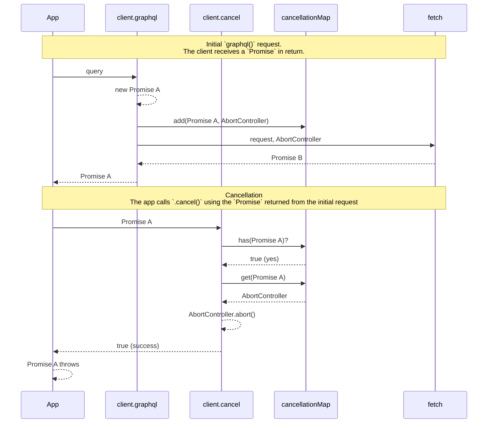

# Cancellation

The Amplify library supports canceling in-flight service requests after they've been issued. This is done in a best-effort manner internally using an [`AbortController`](https://developer.mozilla.org/en-US/docs/Web/API/AbortController) provided to `fetch()`. (Cancelling an already-issued mutation, for example, is never **guaranteed** to prevent the mutation.) For modeled operations (operations that are generated attached to the client based on the customer schema), there is some added complexity.

This document provides an high level overview of how the core cancellation works and how it has been extended to modeled operations.

### Basic `graphql()` Cancellation Support

Here's the high level overview of how the core cancellation mechanisms works. Strictly speaking, there's an additional layer of mapping between GraphQL category and REST category. But, for the sake of simplicity and from the perspective of `@aws-amplify/data-schema`, we can think of it like this:



### The "Gap" in Modeled Operations

Modeled operations (e.g., `client.Todo.list()`) are not inherently cancellable by the simple virtue of using `client.graphql()` under the hood. This is due to the layers of response processing needed by modeled operations, which ultimately results in the customer-facing `Promise` being distinct from the original, underlying, "cancellable" `Promise`.

Again, simplifying the REST layer out of our conceptual model, here's gap in the flow: 

```mermaid
sequenceDiagram
    participant App
    participant client.model.get()
    participant client.graphql
    participant client.cancel
    participant cancellationMap
    participant fetch
    
    note over App, fetch: Initial `graphql()` request.<br />The client receives a `Promise` in return.
    
    App ->> client.model.get() : id
    client.model.get() ->> client.graphql : query
    client.graphql -->> client.graphql : new Promise A
    client.graphql ->> cancellationMap : add(Promise A, AbortController)
    client.graphql ->> fetch : request, AbortController
    fetch -->> client.graphql : Promise B
    client.graphql -->> client.model.get() : Promise A
    client.model.get() -->> App : Promise C
    
    note over App, fetch: Cancellation<br />The app calls `.cancel()` using the `Promise` returned from the initial request.
    
    App ->> client.cancel : Promise C
    client.cancel ->> cancellationMap : has(Promise C)?
    cancellationMap -->> client.cancel : false (no)
    client.cancel -->> App : false (failure)
```

**TLDR:** The underlying `client.cancel()` operation will recognize a `Promise` from `client.graphql()`, but the `Promise` returned from modeled operations is a completely new and distinct `Promise`! So `client.cancel()` has no idea what to do with it ***by default***.

### The Solution

We create a map from the newly created `Promise` in inside the modeled operations (`Promise C`) and "monkey patch" `client.cancel()` so that it first looks for a mapping before forwarding the `Promise` to the internal `cancel()`. To ensure our monkey patch doesn't interfere with core cancellation behavior, we have also explicitly added testing for cancellation of the core `graphql()` operations.

With the mapping, modeled operations now look like this (still simplified):

```mermaid
sequenceDiagram
    participant App
    participant client.model.get()
    participant promiseMap
    participant client.graphql
    participant client.cancel
    participant cancellationMap
    participant fetch
    
    note over App, fetch: Initial `graphql()` request.<br />The client receives a `Promise` in return.
    
    App ->> client.model.get() : id
    client.model.get() ->> client.graphql : query
    client.graphql -->> client.graphql : new Promise A
    client.graphql ->> cancellationMap : add(Promise A, AbortController)
    client.graphql ->> fetch : request, AbortController
    fetch -->> client.graphql : Promise B
    client.graphql -->> client.model.get() : Promise A
    client.model.get() -->> promiseMap : add(Promise C, Promise A)
    client.model.get() -->> App : Promise C
    
    note over App, fetch: Cancellation<br />The app calls `.cancel()` using the `Promise` returned from the initial request.
    
    App ->> client.cancel : Promise C
    client.cancel ->> promiseMap : get(Promise C)?
    promiseMap -->> client.cancel : Promise A
    client.cancel ->> cancellationMap : has(Promise A)?
    cancellationMap -->> client.cancel : true (yes)
    client.cancel ->> cancellationMap : get(Promise A)
    cancellationMap -->> client.cancel : AbortController
    client.cancel -->> client.cancel : AbortController.abort()
    client.cancel -->> App : true (success)
    App -->> App : Promise C throws
```

When the app attempts to cancel a `Promise` from a modeled operation, `client.cancel()` sees the `Promise` in the map, finds the original/core `Promise`, and cancels *that* `Promise`.

## Important Patterns and Utilities

A few of the mechanistic details to help facilitate this promise mapping.

### `extendCancellability`

This function maps one `Promise` to another and returns an "extended" version of the base `Promise`. When using the utility, use the return value as if it were the original base `Promise`. This will better ensure there is no "danging" `Promise` that will spew async errors into in runtime. E.g.,

```ts
const extendedPromise = extendCancellability(basePromise, resultPromise);
const { data, extensions } = await extendedPromise;
```

In theory, with this utility, you should be able to create an arbitrarily deep chain of promises. `client.cancel()` will start walking the map until it either:

1. Finds a cycle and throws an exception &mdash; *A bug if it happens!*
1. Finds the leaf `Promise` (or `undefined`) and forward what it finds to the *original/core* `cancel()`.

See [`extendCancellability`](./packages/data-schema/src/runtime/internals/cancellation.ts).

### Promise Chains

In order to map the `Promise` we hand back to application-space to the original, cancellable `Promise`, we need to follow **two patterns**.

#### 1) Avoid `async functions`'s.

When we create an `async function` and return a `Promise` from that function, the internally returned `Promise` does **not** get directly returned externally. You can try it out [here](https://www.typescriptlang.org/play/?#code/MYewdgziA2CmB0w4EMBOAKAlAbgFC7gBcACASzDFlQAVUQBbUiWALmOTAE89kJOxgxAGYBXAYVLhi9ZAGtYtBk1hZiAb1zEtZClUWNmxALzFKAd2L7l6VUYB86gL45N21LEIjUYHZRp0DWDxHXFBIEhARQj0A5WNpOQVY5iw8UPAoOHhoEABzdHI-K0MjUuJI6P8lZhwgA):

```ts
let innerPromise: any;
async function makePromise() {
    innerPromise = Promise.resolve('ok');
    return innerPromise;
}
const outerPromise = makePromise();

console.log(innerPromise === outerPromise); // false

innerPromise.then((m: string) => console.log(m)); // ok
outerPromise.then((m: string) => console.log(m)); // ok
```

To solve this, every "async" function that needs to return a "cancellable" `Promise` must *avoid* using the `async` keyword between the creation of the "cancellable" `Promise` and the public surface.

If you remove `async` from the code above, TS still recognizes the return value as a `Promise`, but no longer creates an additional `Promise` layer.

#### 2) Use Self-Aware Promises

The resolver code for the `Promise` we intend to be cancellable needs to "know" about the `Promise`. Your typical `Promise` construction isn't self-aware:

```ts
function makePromise() {
    const p = new Promise(resolve => {
        console.log(p);
        resolve();
    });
    return p;
};

const x = makePromise();
//        ^
//        |
//        +-- ReferenceError: Cannot access 'p' before initialization
```

A typical "trick" to get around this is to "export" the `resolve` and `reject` functions and handle them *outside* the `Promise` body. But, this can make the code harder to trace through without introducing some additional "ceremonious" `async` boilerplate to facilitate `await`-ing when it's more convenient and grokkable to do so.

To make this easier, a `selfAwareAsync` utility function has been added that encapsulates this ceremony. It accepts an `async` function whose first parameter is the `Promise` it will return.

```ts
function makePromise() {
    return selfAwareAsync(async resultPromise => {
        const corePromise = doStuff();
        const extendedCorePromise = extendCancellability(corePromise, resultPromise);
        const itIsTotallyFineNowTo = await otherThings();
        return 'all done';
    });
}
```

See [`selfAwareAsync`](./packages/data-schema/src/runtime/utils/selfAwareAsync.ts).