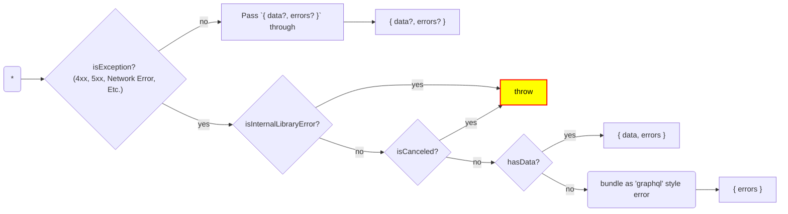

## Error Handling

In general, our goal is for almost all errors to be exposed via the `errors` property that comes back from request. This should generally include all AppSync and other non-200 level errors. If the server responses with GraphQL, the library should respond with `{ data?, errors? }`. If a non-graphql response or error occurs, the library should repond with `data: undefined` and an `errors` entry constructed in the client from the underlying error. Basically, **the customer should expect to handle all errors *except for cancellations* via the `errors` property.**

The exceptions are:

1. **Cancellation errors.** If the customer explicitly cancels the request, the request `throws`.
2. **Library bugs.** In other words, all other cases, the library *should* be wrapping thrown exceptions into `errors`, giving customers a single flow for error handling. Thrown exceptions apart from item 1 are therefore always bugs.

### The "input" dimensions considered.

| Dimension | Meaning | Values / Examples |
| -- | -- | -- |
| `isException` | Whether an exception was thrown from the `fetch()` layer | Network Error / No connectivity. |
| `isCanceled?` | Whether the customer call invoked cancellation explicitly | `true \| false` |
| `data?` | What "type" of `data` value is present in the graphql response | `{...result} \| null \| undefined` <sup>1</sup> |
| `errors?` | What "type" of `data` value is present in the graphql response | `[...errors] \| undefined` <sup>1</sup> |

### The "output" dimensions we must define:

| Dimension | Meaning | Values / Examples |
| -- | -- | -- |
| `throw` | We throw an exception | Internal Amplify library error or intentional customer cancellation |
| `data?` | What "type" of `data` value we return | `{...object} \| [...items] \| null \| undefined` <sup>1</sup> |
| `errors?` | What "type" of `data` value we return | `[...errors] \| undefined` <sup>1</sup> |


<sup>1. `undefined` means *absent*.</sup>



At this point, I posit that all other Exception are actually bugs. Where possible, we wrap all exception up into objects that "look like" graphql errors in the response:

```typescript
const { data, errors } = client.models.MyModel.get({id});
//      ^     ^
//      |     |
//      |     +-- This should always equal what was returned by
//      |         the server, except in cases where we either have
//      |         have "built" an error from an non-200 level HTTP
//      |         response from outside AppSync or a
//      |         library-internal exception.
//      |
//      +--  This should always just equal what was returned by the
//           server, passed through an "instantiation" layer that
//           attaches lazy loaders when applicable.
```